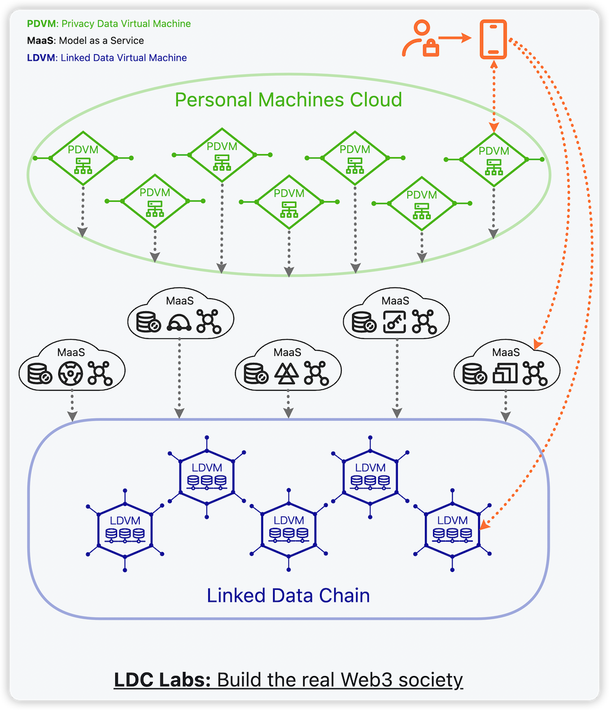
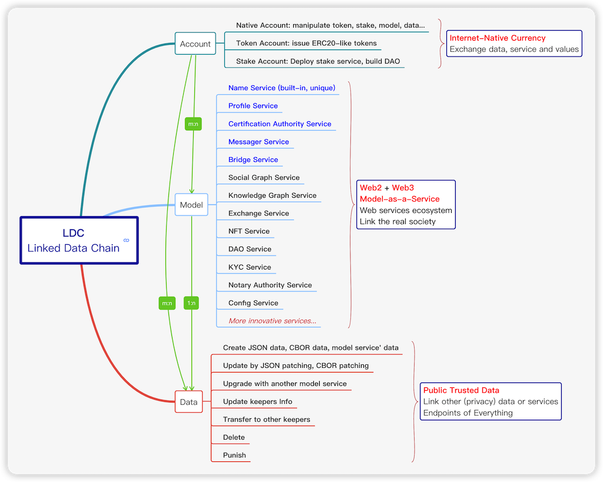

Linked Data Virtual Machine (LDVM) - WIP

Linked Data Store runing on Avalanche Subnets.

## Architecture

## Features

## License

The ldvm library (i.e. all code outside of the `cmd` directory) is licensed under the
[GNU Lesser General Public License v3.0](https://www.gnu.org/licenses/lgpl-3.0.html),
also included in our repository in the `LICENSE.LESSER` file.

The ldvm binaries (i.e. all code inside of the `cmd` directory) is licensed under the
[GNU Affero General Public License v3.0](https://www.gnu.org/licenses/agpl-3.0.html), also
included in our repository in the `LICENSE` file.
